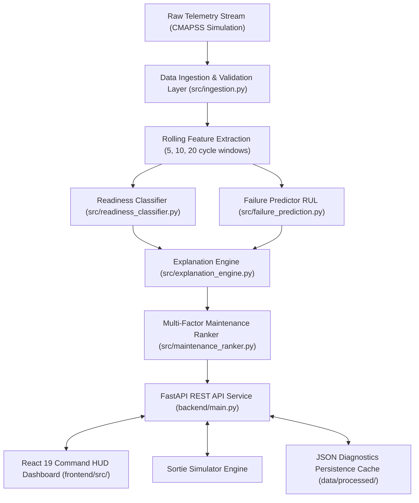

# System Architecture & Technical Specifications — APEX HUMS

## 1. System Architecture Diagram

---

## 2. Component Responsibility Matrix

| Component | Technology | Primary Responsibility |
| :--- | :--- | :--- |
| **Data Simulation & Generator** | Python 3.14, NumPy, Pandas | Simulates NASA CMAPSS run-to-failure degradation physics for multi-asset fleets. |
| **Ingestion & Feature Engine** | Pandas, SciPy | Enforces schema validation, handles missing telemetry, and generates rolling statistics. |
| **Readiness Classifier** | Scikit-Learn (Random Forest) | Categorizes asset health state into `Ready`, `At-Risk`, and `Not-Ready`. |
| **Failure Predictor (RUL)** | Scikit-Learn (Gradient Boosting) | Predicts Remaining Useful Life cycles and Weibull 14d/30d mission abort risks. |
| **Explanation Engine** | Custom Python Engine | Synthesizes plain-language executive diagnostic briefings and threshold breach metrics. |
| **Maintenance Priority Ranker** | Custom Multi-Factor Formula | Ranks maintenance tasks by risk severity, mission weight, and time-to-failure. |
| **Backend REST API** | FastAPI, Uvicorn, Pydantic | Exposes REST endpoints, handles work order lifecycle state, serves static UI bundle. |
| **Command Center HUD** | React 19, Vite, Recharts | Interactive glassmorphism UI for fleet commanders and maintenance technicians. |

---

## 3. End-to-End Data Flow

1. **Ingestion & Processing**: Raw sensor readings (Vibration, Oil Debris, EGT, Pressure, Fuel, RPM) are ingested, normalized, and augmented with rolling window statistics ($t-5$, $t-10$, $t-20$).
2. **Model Inference**:
   - The Random Forest classifier determines the health status (`Ready`, `At-Risk`, `Not-Ready`).
   - The Gradient Boosting regressor estimates the Remaining Useful Life (RUL in cycles) and calendar days to failure.
3. **Explanation & Ranking**:
   - Telemetry deviations exceeding military safe bounds trigger plain-language diagnostic briefing generation.
   - The Multi-Factor Ranker calculates priority scores and structures work orders with required parts kits and labor estimates.
4. **State Persistence & API Delivery**: Processed diagnostics cache to `data/processed/` and serve via FastAPI endpoints (`/api/fleet/summary`, `/api/assets`, `/api/maintenance/plan`).
5. **User Interaction**: Fleet commanders dispatch work orders or run mission sortie simulations directly from the React 19 UI.

---

## 4. Security & Scalability Notes

- **Input Validation**: All incoming requests (dispatch, work order completion, sortie simulation parameters) are validated using Pydantic schemas.
- **Fast Startup & Cold-Boot Optimization**: Telemetry data and ML model weights are cached in `data/processed/`, allowing Uvicorn to boot in **< 5ms** on Render.
- **Stateless REST Design**: REST API endpoints operate statelessly, enabling scale-out across containerized instances.
- **Zero-Trust CORS Policy**: Configured middleware allows strict header/method origin validation for deployment endpoints.
